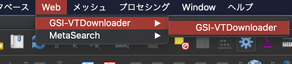
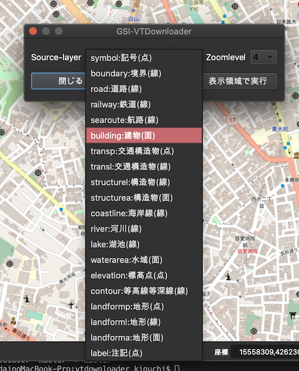
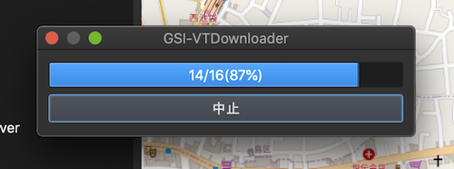

# GSI-VTDownloader

QGISで国土地理院ベクトルタイルをダウンロードしてベクターレイヤとして追加するためのプラグイン

## 使い方

### メインウィンドウを開く

メニューバー->Web->GSI-VTDownloaderで開く




### 対象レイヤーの選択

表示したいSouce-layerとZoomlevelをプルダウンメニューから選択する



### 処理を実行
「矩形範囲で実行」か「表示領域で実行」のいずれかを選べます



#### 矩形範囲で実行
ボタンを押下するとラバーバンドモードに切り替わるので、地図上をドラッグして領域を指定してください

#### 表示領域で実行
ボタンを押下するとダウンロード処理が開始します
表示領域に一部分でも含まれるタイルデータをすべてダウンロードします

## その他

本プログラムはGPL2.0ライセンスの下に頒布されます

本プラグインで取得出来るデータの利用は、当然ながら国土地理院が示すルールにしたがってください
    [gsi-cyberjapan/gsimaps-vector-experiment](https://github.com/gsi-cyberjapan/gsimaps-vector-experiment)


## ライセンス表記

本プログラムは以下の外部ライブラリを使用しています

- [tiletanic](https://github.com/DigitalGlobe/tiletanic)
- [shapely](https://github.com/Toblerity/Shapely)

```
Copyright (c) 2007, Sean C. Gillies
All rights reserved.

Redistribution and use in source and binary forms, with or without
modification, are permitted provided that the following conditions are met:

    * Redistributions of source code must retain the above copyright
      notice, this list of conditions and the following disclaimer.
    * Redistributions in binary form must reproduce the above copyright
      notice, this list of conditions and the following disclaimer in the
      documentation and/or other materials provided with the distribution.
    * Neither the name of Sean C. Gillies nor the names of
      its contributors may be used to endorse or promote products derived from
      this software without specific prior written permission.

THIS SOFTWARE IS PROVIDED BY THE COPYRIGHT HOLDERS AND CONTRIBUTORS "AS IS"
AND ANY EXPRESS OR IMPLIED WARRANTIES, INCLUDING, BUT NOT LIMITED TO, THE
IMPLIED WARRANTIES OF MERCHANTABILITY AND FITNESS FOR A PARTICULAR PURPOSE
ARE DISCLAIMED. IN NO EVENT SHALL THE COPYRIGHT OWNER OR CONTRIBUTORS BE
LIABLE FOR ANY DIRECT, INDIRECT, INCIDENTAL, SPECIAL, EXEMPLARY, OR
CONSEQUENTIAL DAMAGES (INCLUDING, BUT NOT LIMITED TO, PROCUREMENT OF
SUBSTITUTE GOODS OR SERVICES; LOSS OF USE, DATA, OR PROFITS; OR BUSINESS
INTERRUPTION) HOWEVER CAUSED AND ON ANY THEORY OF LIABILITY, WHETHER IN
CONTRACT, STRICT LIABILITY, OR TORT (INCLUDING NEGLIGENCE OR OTHERWISE)
ARISING IN ANY WAY OUT OF THE USE OF THIS SOFTWARE, EVEN IF ADVISED OF THE
POSSIBILITY OF SUCH DAMAGE.
```